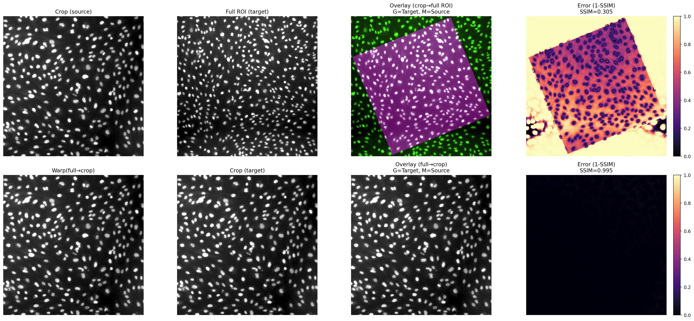
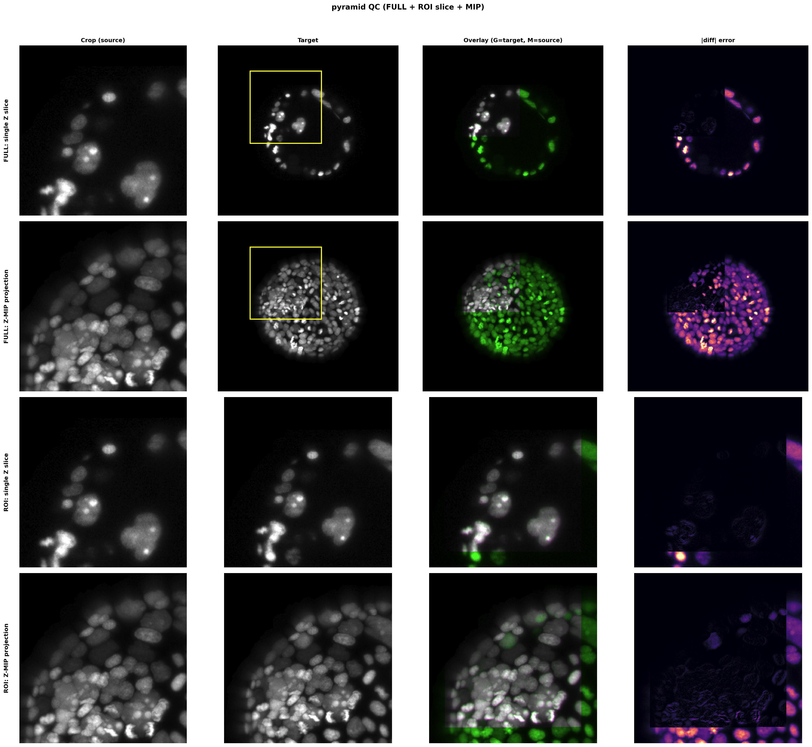

# Visualization & Quality Control

[:arrow_left: Documentation index](index.md)

Registration is a scientific measurement, not a magic trick. You must verify that the recovered transform is biologically and geometrically plausible before trusting the data.

This page covers the visual and numerical QC workflows for both **2D** and **3D** pipelines.

---

## 🚦 Quick Checklist (2D & 3D)

1. **Orientation Check:** Does the warped crop generally sit in the right place on the reference?
2. **Ghosting Check:** In the overlay, do boundaries appear crisp (white/grey) or do you see distinct green/magenta separation (ghosting)?
3. **Metric Check:** Does `frac_inliers` pass your pipeline's threshold, and is `mean_error_um` biologically plausible?
4. **Independent Validation:** (Best Practice) Does the transform align a channel that was *not* used for registration (e.g., align on DAPI, check overlap on GFP)?

---

## ✅ QC: Accept / Investigate / Reject

Use this as a **practical triage** right after every run.

### What the two core metrics mean (plain language)

* **`frac_inliers`**:
  * The fraction of proposed matches that agree with one shared transform.
  * Higher is better: more nuclei agree on the same geometric answer.


* **`mean_error_um`**:
  * The average residual distance (in microns) between matched nuclei after alignment.
  * Lower is better: matched nuclei land closer together in physical space.


### Baseline pass criteria (from code defaults)

These are good **starting thresholds** based on the pipeline's internal defaults. Final thresholds depend on nuclear density, segmentation quality, and pixel/voxel sizes.

For canonical transform field names, legacy alias mapping, and JSON/JSONL loader notes, see:
* [Exports → Canonical transform schema (2D and 3D)](exports.md#5-canonical-transform-schema-2d-and-3d)

| Pipeline persona | Baseline pass (`Accept`) | Investigate band | Reject guidance |
| --- | --- | --- | --- |
| **2D users** | `frac_inliers >= 0.60` and `mean_error_um` is biologically small for your nuclei. | `frac_inliers` near `0.60` with visually suspicious overlay/error map. | `frac_inliers < 0.60` after basic checks, or overlays clearly wrong. |
| **3D users** | `frac_inliers >= 0.45` and `mean_error_um` is biologically small for your nuclei (account for Z anisotropy). | `frac_inliers` near `0.45` or acceptable `frac_inliers` with suspicious MIPs/slices. | `frac_inliers < 0.45` after basic checks, or 3-view overlays clearly wrong. |

### Escalation guidance

* **If `frac_inliers` is low**:
    1. Re-check segmentation quality (under/over-segmentation, merged nuclei, debris).
    2. Confirm crop ROI truly overlaps the same tissue region in the full image.
    3. Try a different matcher mode (2D: `triangles` vs `graph`; 3D: `pyramid` vs `hashing`).
    4. Optionally loosen `inlier_radius_um` **cautiously** (small increments), then re-check overlays to avoid accepting spurious matches.


* **If `mean_error_um` is high but `frac_inliers` passes**:
    * Treat this as likely **systematic misalignment** (consistent offset/rotation/scale phase error), not a random failure.
    * Inspect overlay panels and error maps/MIPs for global drift patterns before accepting.


---

## 🖼️ 2D Quality Control

### The "One-Stop Shop" Function

For 2D, the `show_alignment_original_and_rescaled` function is your best friend. It automatically:

1. Warps your original crop using the calculated transform.
2. Normalizes contrast for both images using percentile normalization.
3. Calculates error metrics (SSIM).
4. Generates a visual overlay (and saves it if you provide a `save_dir`).

```python
from nucleisky2d.visualization import show_alignment_original_and_rescaled

# res = NucleiSky(...) output dictionary

show_alignment_original_and_rescaled(
    res,
    img_full_orig=img_full,
    img_crop_orig=img_crop,
    pixel_size_full_orig_um=pixel_size_full_um,
    pixel_size_crop_orig_um=pixel_size_crop_um,
    save_dir="nucleisky_output", # Saves "original_overlay.png" here
)

```

### What `plot_warp_overlay` shows

`plot_warp_overlay(plot_data, ...)` is the function that renders the QC figure. In the standard pipeline, you usually do **not** call it directly—`show_alignment_original_and_rescaled(...)` already calls `warp_and_save_metrics(...)` and then forwards the returned `plot_data` into `plot_warp_overlay(...)` for you.

#### SSIM and why `1 - SSIM` is an error map

* **SSIM (Structural Similarity Index)** ranges from **0 to 1** in this workflow.
* `1.0` means local structure is very similar; values closer to `0` mean local structure differs.
* The plotted panel uses **`1 - SSIM`** so it behaves like an **error heatmap**:
* **0 (dark)** = low local error (good local match).
* **1 (bright)** = high local error (local mismatch).

In implementation terms: `warp_and_save_metrics(...)` computes the SSIM maps and clips them to create the error array `np.clip(1.0 - ssim_map, 0, 1)`. `plot_warp_overlay(...)` then displays these arrays using the "magma" colormap.

#### Panel-by-panel interpretation guide



When `also_warp_full_to_crop=True` (default), you get a 2×4 layout:

| **`Crop (source)`** | **`Full ROI (target)`** | **`Overlay (crop→full ROI)`** | **`Error (1-SSIM)` with global SSIM value** |
| - | - | - | - |
| Original crop before warping.<br><br>Use this to confirm crop quality: focus, staining, saturation. | Target region from the full image where the crop is expected to land. | Green = target `full_roi_n`.<br>Magenta = warped source `crop_warp_n`.<br><br>**What to look for:**<br>Mostly white/gray structures: good alignment.<br><br>Thin edge fringes only: usually acceptable minor deformation/interpolation effects.<br><br>Repeated magenta/green doubles across many structures: translation, rotation, or scale mismatch. | Highlights where structure differs even if overlay colors look subtle.<br><br>**Common failure patterns:**<br>Bright at one edge only: partial cropping or bbox margin issues.<br><br>Bright streaks around high-contrast boundaries: interpolation + small geometric drift.<br><br>Broad bright regions everywhere: wrong match, wrong tissue region, or strong transform error. |
| **`Warp(full→crop)`** | **`Crop (target)`** | **`Overlay (full→crop)`** | **`Error (1-SSIM)` for reverse direction** |
| Reverse-direction warp of full ROI into crop frame.<br><br>Useful to sanity-check transform symmetry. | Same crop used as target in the reverse comparison. | Same interpretation logic as Row 1 overlay. | Helps detect asymmetric artifacts from interpolation or clipping.|


If `also_warp_full_to_crop=False`, only the first row (1×4) is shown.

#### Important warning: intensity normalization can hide contrast problems

Before SSIM is computed, images are percentile-normalized to `[0, 1]`. This makes structure comparison more robust across routine acquisition variation, but can also make two images with very different absolute contrast appear more similar than expected.

Practical consequence:

* A decent SSIM score does **not** guarantee identical intensity physics.
* If channels/exposure differ strongly, prioritize the overlay geometry and independent biological validation (e.g., check a channel not used for registration), not SSIM alone.

### Example: standard call vs direct plotting

```python
from nucleisky2d.visualization import (
    show_alignment_original_and_rescaled,
    plot_warp_overlay,
)
from nucleisky2d.export import warp_and_save_metrics

# Recommended in most cases: one call handles warp, normalization, metrics, and plotting.
show_alignment_original_and_rescaled(
    res,
    img_full_orig=img_full,
    img_crop_orig=img_crop,
    pixel_size_full_orig_um=pixel_size_full_um,
    pixel_size_crop_orig_um=pixel_size_crop_um,
    save_dir="nucleisky_output",
)

# Optional direct mode (developer/debug workflow):
# use this when you want explicit access to bbox + metric arrays before plotting.
bbox, plot_data = warp_and_save_metrics(
    img_full=img_full,
    crop_img_proc=img_crop,
    ij_percentile_normalize=lambda x: x,  # replace with your normalization function
    pixel_size_full_um=pixel_size_full_um,
    pixel_size_patch_um=pixel_size_crop_um,
    best_scale=res["best_scale"],
    best_R=res["best_R"],
    best_t=res["best_t"],
    return_plot_data=True,
)

# plot_data contains arrays such as err_1/err_2 and SSIM values used by the figure.
plot_warp_overlay(plot_data, save_dir="nucleisky_output", save_prefix="manual")

```

---

## 🧊 3D Quality Control

### The `plot_warp_overlay3d` QC figure (authoritative 3D visual check)

In 3D, a single central slice can look "good" while the rest of the stack is misregistered. The canonical function is:

* `plot_warp_overlay3d(...)` (alias: `plot_warp_overlay3D(...)`).

This function builds a multi-row QC panel with four columns:

1. **Crop (source)**
2. **Target** (FULL or ROI)
3. **Overlay (G=target, M=source)**
4. **`|diff|` error** (absolute intensity difference after shared normalization)

The plot includes both:

* **Single Z slice** (fine local detail check)
* **Z-MIP projection** (global geometry check)

And, by default, it will show both **FULL-view rows** (`FULL: single Z slice`, `FULL: Z-MIP projection`) and **ROI rows** (`ROI: single Z slice`, `ROI: Z-MIP projection`).

```python
from nucleisky3d.visualization import plot_warp_overlay3D

fig = plot_warp_overlay3D(
    img_full_zyx=img_full,
    img_crop_zyx=img_crop,
    record_or_result=best_res,
    pixel_size_full_um_zyx=voxel_full_um_zyx,
    pixel_size_crop_um_zyx=voxel_crop_um_zyx,
    save_path="./qc_overlay_3d.png",
    show=False, # Set to True to display in notebook
)

```

### 🔬 How to interpret each 3D panel (practical reading guide)




Color semantics are identical to 2D:

* **Green** = fixed target (full/ROI).
* **Magenta** = warped crop.
* **White/gray overlap** = agreement.

Read columns in this order:

1. **Crop vs Target sanity check**
* Ensure morphology and FOV complexity are comparable.
* Major intensity/composition mismatch here often means you are comparing non-overlapping biology.


2. **Overlay panel (geometry)**
* **Good:** nuclei boundaries mostly coincide (white/gray) with only thin magenta/green rims.
* **Translation error:** nearly uniform magenta/green offset across structures.
* **Rotation/shear error:** one side aligns, opposite side ghosts.
* **Scale error:** center may align while peripheral nuclei diverge radially.


3. **`|diff|` panel (where mismatch lives)**
* *Developer Note:* Unlike the 2D pipeline which uses 1-SSIM, the 3D QC pipeline computes error as `np.abs(full_slice_n - warp_slice_n)` mapped to the "magma" colormap.
* `|diff|` is **absolute difference**, so bright areas mark local disagreement.
* **Expected mild brightness:** high-gradient boundaries (interpolation effects).
* **Concerning patterns:** broad bright regions, directional gradients, or edge-heavy bright bands that mirror global drift.


Then compare row types:

* **Single Z row:** best for local boundaries and depth-specific failure.
* **Z-MIP row:** best for global placement/rotation.
* **FULL rows:** catch gross transform errors against full field context.
* **ROI rows:** catch local misfit inside the computed bounding region.

#### Common interpretation traps

* **MIP looks good, slice looks bad:** often a depth-specific issue (wrong Z placement, tilt, or anisotropy mismatch).
* **Slice looks good, MIP looks bad:** local plane happened to align; global 3D transform is still off.
* **Overlay looks okay but `|diff|` is globally bright:** likely systematic drift or intensity normalization masking weak geometric mismatch.

**Red flag:** if any one row/view fails badly, treat the alignment as suspect until resolved.

### 📏 Voxel anisotropy: why `pixel_size_um_zyx` correctness is critical

3D matching and QC are done in **physical units (µm)**. If voxel spacing metadata is wrong, your transform and QC metrics become physically wrong even when overlays can appear plausible.

Key points:

* The API expects voxel sizes to be provided in **`(z, y, x)` order**, in µm.
* `match_quality` is computed using nearest-neighbor distances in µm and compared against `inlier_radius_um`.
* Bounding-box placement and warping also depend entirely on these voxel sizes.

Practical consequences of wrong voxel metadata:

* **Incorrect Z spacing (most common):**
* If Z step is under-reported, depth errors are artificially compressed.
* If Z step is over-reported, small slice shifts are exaggerated.


* **Axis-order mistakes (`xyz` passed as `zyx`):** apparent mirror/stretch artifacts, unstable success across matchers, and misleading inlier/error values.

### 🎯 3D threshold guidance (defaults and tuning)

The 3D defaults are:

* `inlier_radius_um = 2.0`.
* `frac_inliers_thresh = 0.45`.

Interpretation:

* `frac_inliers` = fraction of transformed crop centroids whose nearest full centroid is within `inlier_radius_um`.
* `mean_error_um` = average inlier nearest-neighbor distance in µm.

Use default settings as your starting calibration point:

* **Accept (typical baseline):** `frac_inliers >= 0.45` with overlay/`|diff|` patterns that are globally coherent.
* **Investigate:** `frac_inliers` near threshold or visual disagreement in any row/view.
* **Reject:** clearly wrong overlays/`|diff|` patterns or persistently low inlier fraction after basic data checks.

When to **tighten** thresholds (higher confidence regime):

* high-SNR images with clean segmentation,
* dense nuclei with rich unique geometry,
* stable acquisition protocol and validated voxel metadata.

Practical tightening options:

* Raise `frac_inliers_thresh` (e.g., to `0.70–0.80`).
* Optionally reduce `inlier_radius_um` (e.g., `2.0 → 1.5`) if expected biological variability supports it.

When to **loosen** thresholds (recovery / hard-data regime):

* sparse nuclei,
* moderate segmentation miss/split/merge noise,
* mild tissue deformation or lower SNR.

Practical loosening options (small steps only):

* Lower `frac_inliers_thresh` slightly (e.g., `0.45 → 0.35–0.40`).
* Increase `inlier_radius_um` conservatively (e.g., `2.0 → 2.5–3.0`).

Always pair threshold changes with visual QC.

---

## 📊 Numerical QC (For Developers)

Visuals are subjective; numbers are not. Every `NucleiSky` result dictionary contains a `match_quality` object.

```python
quality = best_res.get("match_quality", {})

print(f"Success:      {best_res['success']}")
print(f"Inliers:      {quality.get('frac_inliers', 0):.2%}")
print(f"Mean Error:   {quality.get('mean_error_um', 0):.2f} µm")

```

### Metric Interpretation Guide

* **`frac_inliers` (Geometric Consensus):**
* Start from the pipeline baselines above (2D: `0.60`, 3D: `0.45`).
* Raise thresholds for dense, clean datasets; lower only with strong visual/biological justification.


* **`mean_error_um` (Residual Drift):**
* The average post-transform centroid mismatch in microns.
* As a rule of thumb, keep this below roughly one nuclear radius for your assay.
* If `frac_inliers` passes but `mean_error_um` stays high, investigate systematic misalignment in overlays/error maps before accepting.
