# NucleiSky in smart microscopy

This is an example of how NucleiSky can be integrated into a smart microscopy workflow and allow the scanning and re-localisation of a query image in a large scanned area. For this use case and this tutorial, we will show how to integrate it into a Nikon microscope with a NIS-Elements AR v6.20 software, but the same principles can be applied to other microscopes and software. NIS-Elements AR includes [JOBS](https://www.microscope.healthcare.nikon.com/en_EU/products/software/nis-elements/nis-elements-jobs) as a feature to automate image acquisition and analysis, allowing the integration with Python and therefore NucleiSky. 

This tutorial is divided into two main sections. The [first section](#setup) covers the setup of the JOBS workflow, which only needs to be done once. The [second section](#run-the-jobs) explains how to run the workflow, which needs to be done every time you want to use it.

## Setup

Before start using the JOBS, be sure that you correctly load everything and configure your microscope settings on the NIS-Elements AR software.

### Step 1: Install the NucleiSky environment

The best approach we found to address all the limitations on our facility (no internet connection, no admin privileges, and no installation of unwanted software on the microscope computer) was to package NucleiSky into a defined Conda environment, install it on a USB stick, bring the stick to the microscope, and point NIS-Elements JOBS to the Python executable in that environment.

Thanks to [LabConstrictor](https://github.com/CellMigrationLab/LabConstrictor), we were able to install NucleiSky and all its dependencies into the USB stick using the provided executable installer.

#### 1. Install NucleiSky on a USB stick

In order to achieve this you can follow the regular [installation instructions](../../.tools/docs/download_executable.md) BUT on the step where you are asked to select the installation folder, you should select the USB stick instead of your computer: 

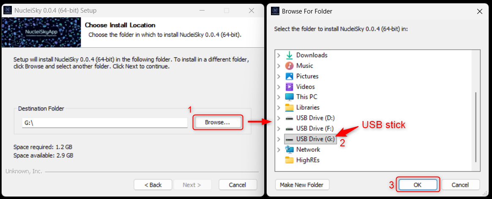

> **Warning**: In our experience this might take a long time to install, so be patient and wait for the installation to finish or let it install overnight.

#### 2. Include NIS-Elements packages into the USB NucleiSky environment

 - Take the USB stick and connect it to the microscope computer where NIS-Elements AR is installed. 
 - In the File Explorer go to `C:\Program Files\NIS Elements\Python\Lib\site-packages`. There, copy `limnode.py` and `limtabletabledata.py`.
 - Paste those files into the `site-packages` folder of the NucleiSky environment in the USB stick. The path should look like this: `USB:\nucleisky\Lib\site-packages`.

On [Step 3](#step-3-adjust-it-to-your-microscope-and-camera-settings) we will indicate you how to set the NucleiSky environment as the Python interpreter for the JOBS GA3 workflow. 

### Step 2: Load the JOBS and GA3 into your NIS-Elements AR software

#### 1. Download the JOBS and GA3 files

Click on the following buttons bellow to download the files and take them to the computer where you have NIS-Elements AR installed.

> You can interactively take a look into the NucleiSky JOBS in the following [website](./assets/JOBS_HTML.html)

> You can interactively take a look into the NucleiSky GA3 in the following [website](./assets/GA3_HTML.html)

#### 2. Open NIS-Elements AR and go to the JOBS tab

On the top menu of the NIS-Elements AR software, click on the JOBS tab and click on `Create New JOB...`
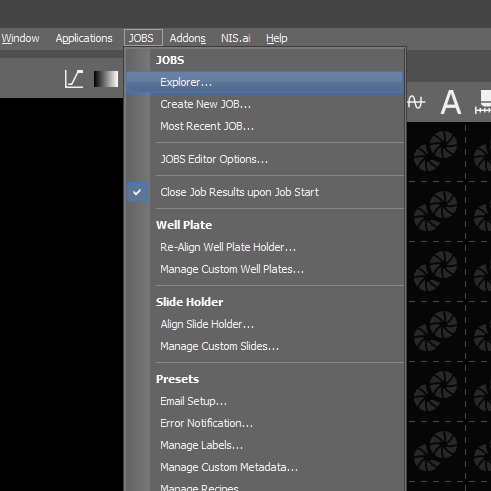

This should open a new window with an empty JOB like this:
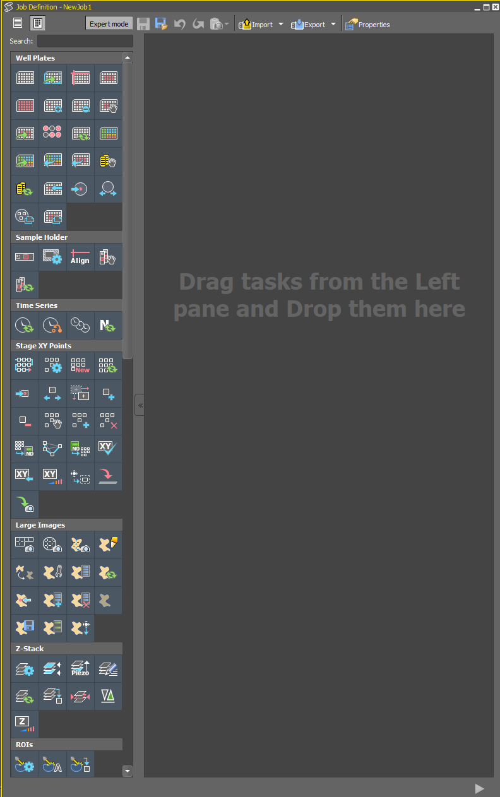

### 3. Import the downloaded JOBS file

On the JOB window click on the `Import` button and select the downloaded JOBS file:

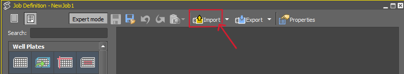

This should load the JOBS file and you should see the following window:

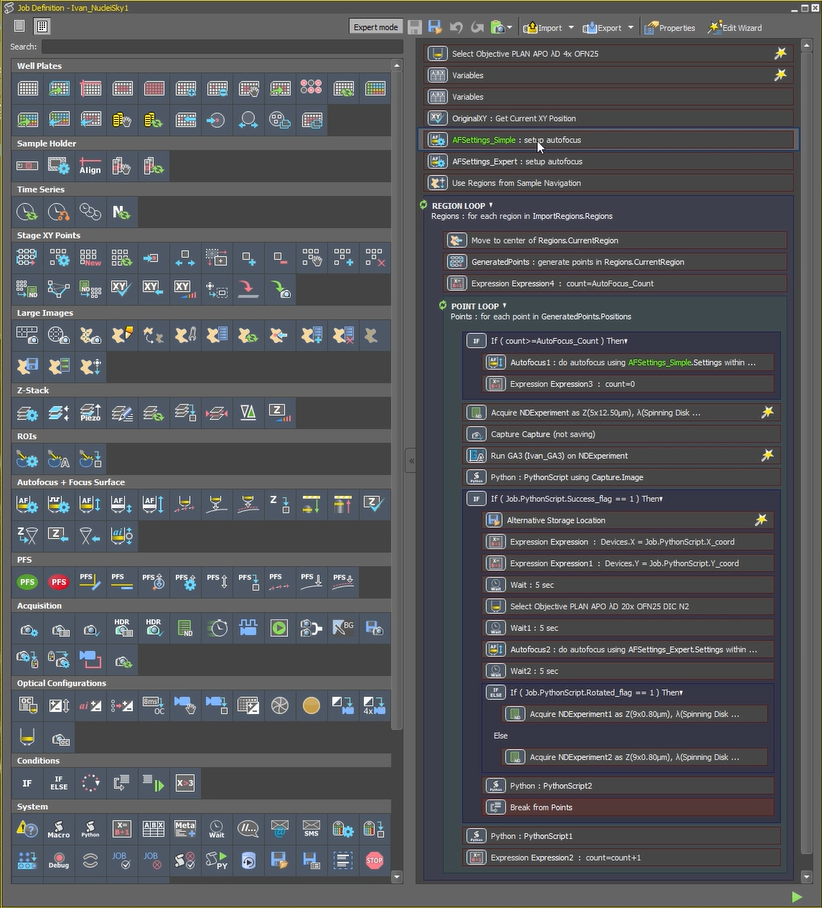

### 4. Import the downloaded GA3 file

Once the JOBS files is correctly loaded, go to `Run GA3 (Ivan_GA3) on ...` and click on it to display the following window:

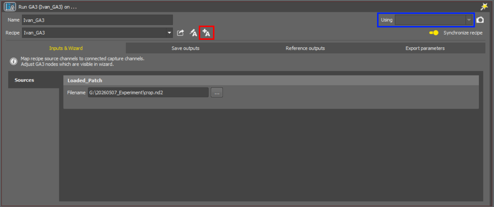

On that window there are two important aspects to consider:

- The `+A` button marked with a red square. Click here to add the downloaded GA3 file to the JOBS.
- The `Using` drop-down menu marked with a blue square. It refers to the image it will use on the GA3 workflow and it should be pointing to `NDExperiment`. In case it is not, click on the drop-down menu and select `NDExperiment`.

### Step 3: Adjust it to your microscope and camera settings

After correctly loading the JOBS and GA3 files, you will need to adjust it to your microscope and camera settings. The following steps are required:

#### 1. Define the optical configuration of your experiment

This is an important step because it defines the acquisition parameters of the JOBS workflow, such as wavelengths, exposure times, and laser power. These settings will affect the final image quality and the amount of photodamage caused during acquisition.

We recommend using two different configurations: one for scanning the large area and another for acquiring the final high-resolution image.

* **Scanning nuclei configuration**: this configuration is used to scan the large area with a low-magnification objective. The goal is to obtain images with enough quality to clearly identify and segment the nuclei, while keeping photodamage as low as possible.
* **Final acquisition configuration**: this configuration is used to acquire the final images with the high-magnification objective. Here, you should define all the channels you want to acquire and adjust the exposure time and laser power to obtain the best image quality possible.

We recommend asking for help from your microscopy facility, or at least manually validating these configurations before running the JOBS workflow. Below are the scanning and final acquisition configurations we used:

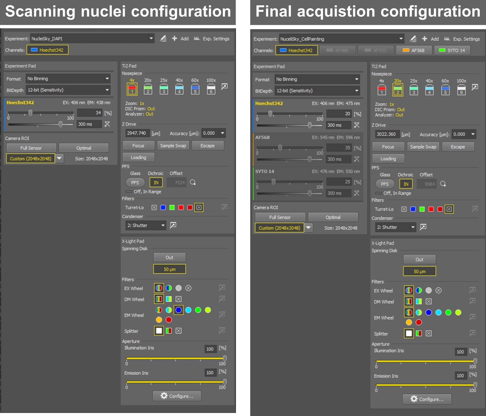

#### 2. Adjust the JOBS parameters to point to your settings

The JOBS workflow will not work unless all the parameters are correctly pointing to a valid configuration. Not all the parameters need to be ajusted, and most probably, when loading the JOBS file, it will indicate on red the parameters that are not correctly set.

Here we let some screenshots and instructions of the parameters that we think that need to be adjusted (if you find any other, please let us know by [creating an issue](https://github.com/CellMigrationLab/NucleiSky/issues/new)):

**Select Objective:**

In our case we had a Plan Apo $\lambda D$ $4 \times$ OFN25. But in your microscope you might have a different objective, click on the drop-down menu and select the one you want to use for scanning the large area. As long as nuclei can be detected, we recommend using a low-magnification objective to speed up the scanning process.

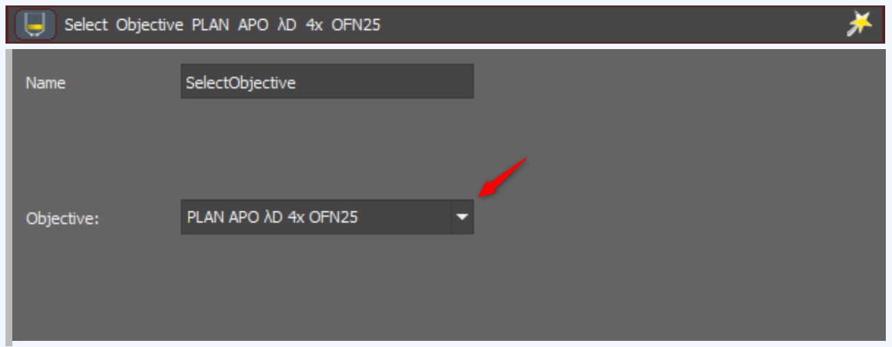

**Auto Focus Settings Simple:**

The simple auto focus settings are used for the large scanning of the area. For that reason, this is just a simple auto focus configuration with $300 \mu m$ range. 

Here, on the `Use OC` section, you should select the optical configuration you defined [here](#1-define-the-optical-configuration-of-your-experiment) for scanning the nuclei in the large area. The other parameters can be left as they are.

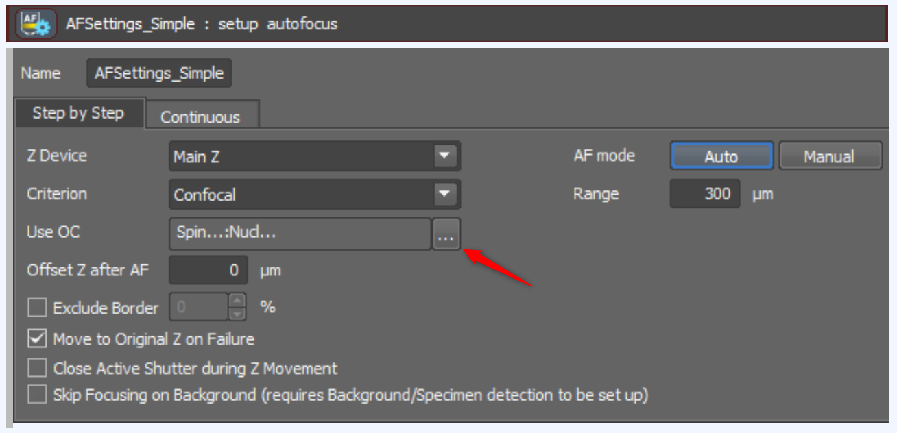

**Auto Focus Settings Expert:**

The expert auto focus settings are used for the final acquisition of the high-resolution image. For that reason, this is a double pass autofocus with a longer $500 \mu m$ range.

Here on the `Use OC` section, you should select the optical configuration you defined [here](#1-define-the-optical-configuration-of-your-experiment) for the final acquisition of the high-resolution image. The other parameters can be left as they are.

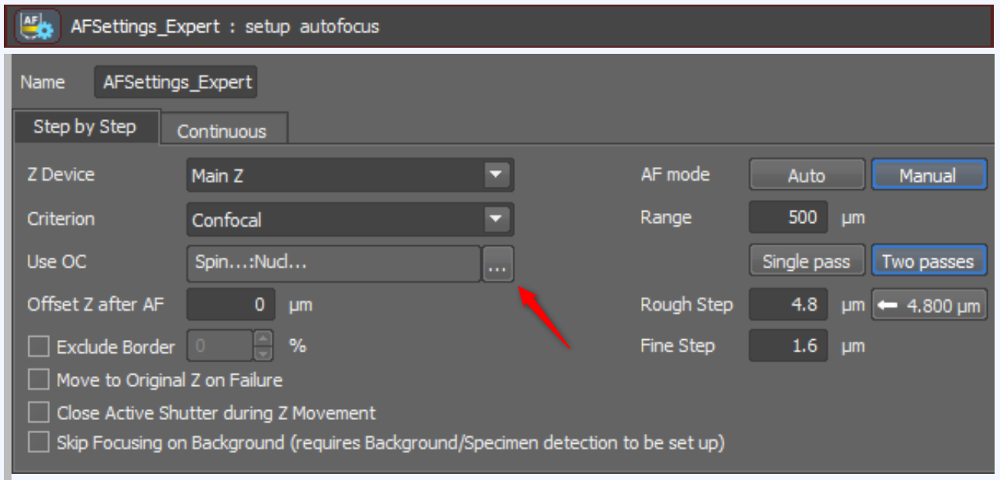

**Acquire NDExperiment:**

The NDExperiment is the acquisition job that takes a Z-Stack of the nuclei channel and that will be used as reference for the NucleiSky re-localisation. 

Here, first you would need to go to the $\lambda$ tab (1). There, you will need to ensure that the optical configuration for Scanning Nuclei with just tge nuclei channel is selected (2). Then, you will need to ensure that your microscope is correctly selected (3). Let the other parameters as they are, unless you want to change the Z-Stack settings.

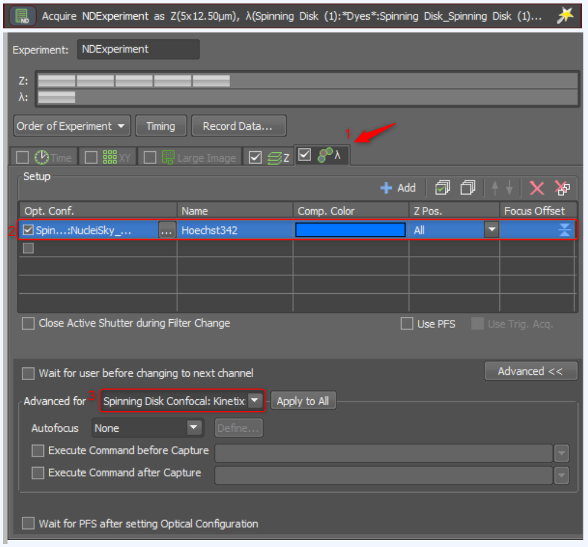

**Run GA3:**

This will continue [4. Import the downloaded GA3 file](#4-import-the-downloaded-ga3-file). As previusly explained, ensure that the `Using` drop-down menu is pointing to `NDExperiment` and that the GA3 file is correctly loaded.

Then, click on the `Edit A` to edit the loaded GA3 workflow as it is indicated with a red arrow in the following screenshot:

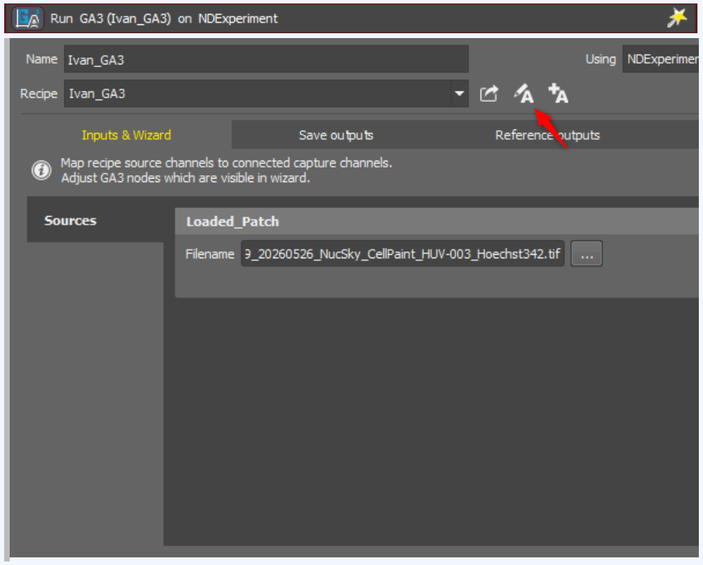

This should open the GA3 window, which should look like this:

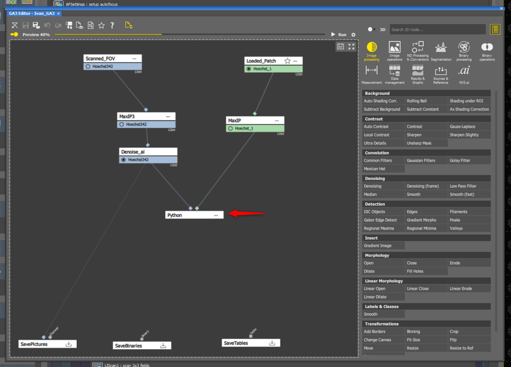

There, as indicated with the red arrow in the previous screenshot, you would need to click on the `Python` block and would open the following window:

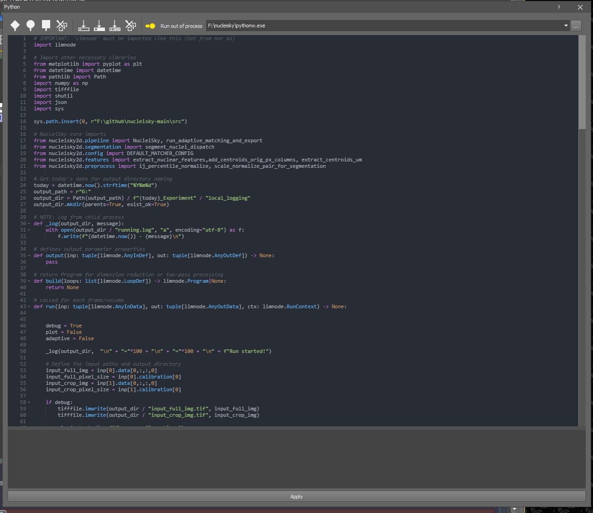

There, the first thing that you will need to do is to point the Python interpreter to the one in the NucleiSky environment in the USB stick. Remember to follow the instructions on [Step 1](#step-1-install-the-nucleisky-environment). To do that, as indicated in the following screenshot, enable the `Run out of process` toggle (1) and select the Python executable in the NucleiSky environment in the USB stick (2). The path should look like this: `USB:\nucleisky\pythonw.exe`.

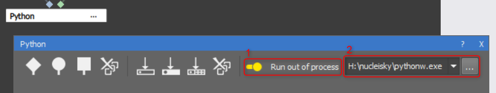

Once that is done, you will need to include the Python code. Most probably, the code will be already loaded, but in case it is not, you can copy and paste the code from the [GA3_Python.py](../../smart_microscopy/GA3_Python.py) file. 

Once loaded, there are some lines that you will need to adjust:
 - [`sys.path.insert(0, r"H:\github\nucleisky-main\src")`](https://github.com/CellMigrationLab/NucleiSky/blob/cfa172d7980446db51224423d896746d75dd88e7/smart_microscopy/GA3_Python.py#L14): Download the NucleiSky repository into the USB and point to the `src` folder in your computer.
 - [output_path = r"G:"](https://github.com/CellMigrationLab/NucleiSky/blob/cfa172d7980446db51224423d896746d75dd88e7/smart_microscopy/GA3_Python.py#L25): Replace the path with the one where you want to save the results of the NucleiSky run. This should be a folder in your computer or in the USB stick.

Finally, remember to save it. In order to do that you will need to save it in three different places: 

1) Click on Apply in the Python window to save the changes in the Python block. This might take a while as it will run the code and check for errors. If you enconter any error, please let us know by [creating an issue](https://github.com/CellMigrationLab/NucleiSky/issues/new).

2) Click on the Save button in the GA3 window to save the changes in the GA3 workflow.

3) Click on the Save button in the JOBS window to save the changes in the JOBS workflow.

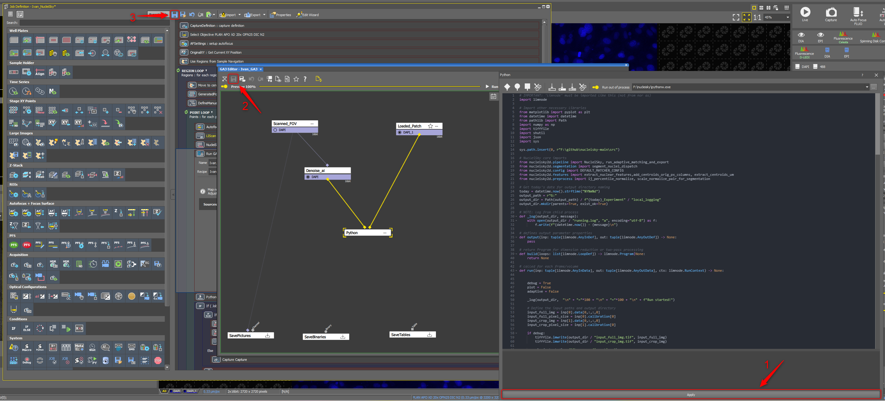

**PythonScript:**

This step takes care of extracting the information from NucleiSky's run and making it available for the rest of the JOBS workflow. 

Here, as indicated in the following screenshot, you will need to the `Task Parameters` tab (1) and ensure that the following parameters are correctly set (2) with their corresponding types (it is important that the names are exactly the same as indicated here):
 - Success_flag: Integer
 - Rotated_flag: Integer
 - X_coord: Double
 - Y_coord: Double

Then, on the `Script` section (3), most probably the code will be already loaded, but in case it is not, you can copy and paste the code from the [PythonScript.py](../../smart_microscopy/PythonScript.py) file. Finally, rememeber to click on the save button (indicated with the red arrow) to save the changes in the PythonScript block.

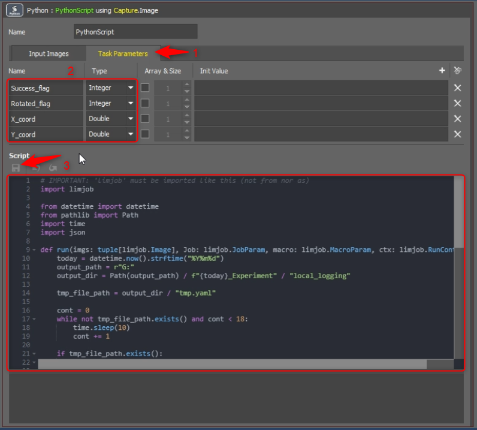

**Second Select Objective (inside the loop):**

This is the objective that will be used to acquire the final high-resolution image. Here, you should select the objective that you want to use for the final acquisition. 

In our case we chose a higher maginfication objective. Be sure that it is an air objective.

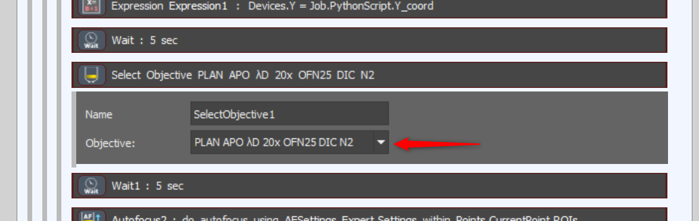

**Acquire NDExperiment1 (final acquisition with rotation detected):**

If NucleiSky has detected a matched and it has declared that some rotation is needed this acquisition, with a $3\times3$ grid, will be used to acquire the final high-resolution image. 

Here, first you would need to go to the 
λ tab (1). There, you will need to ensure that the optical configuration for Final Acquistion defined [here](#1-define-the-optical-configuration-of-your-experiment) with all the channels you want to acquire (2). Then, you will need to ensure that your microscope is correctly selected (3). Let the other parameters as they are, unless you want to change the Z-Stack settings or the Large Image settings.

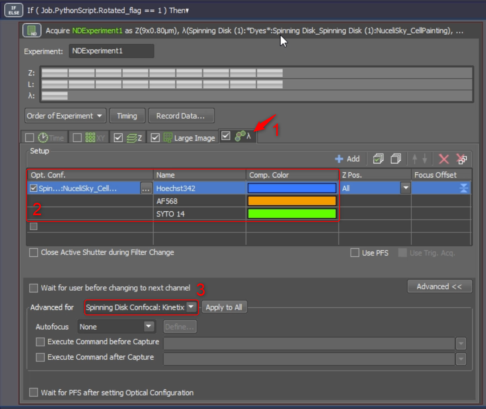

**Acquire NDExperiment2 (final acquisition without rotation detected):**

If NucleiSky has detected a matched and it has declared that no rotation is needed this acquisition, with no grid, will be used to acquire the final high-resolution image.

Here, you will need to ensure the same settings as in the previous step, but this time no Large Image would be needed or just validate that the Large Image is of $1\times1$.

**PythonScript2:**

Ensure that the code in the Sript section is the same as in [PythonScript2.py](../../smart_microscopy/PythonScript2.py) and otherwise copy and paste it. Then, rememeber to click on the save button (indicated with the red arrow) to save the changes in the PythonScript2 block.

**PythonScript1:**

Ensure that the code in the Sript section is the same as in [PythonScript1.py](../../smart_microscopy/PythonScript1.py) and otherwise copy and paste it. Then, rememeber to click on the save button (indicated with the red arrow) to save the changes in the PythonScript1 block.

## Run the JOBS

### Step 1: Select the area to scan

1) Open the Stage Navigator by clicking on `Window > `.

2) Select the stage that you are using by clicking on the `Stage` option on the bottom right corner of the Stage Navigator window.

3) Click on the `Preview` button to acquire a preview of the stage. This might take some time.

4) Once the preview is acquired, modify the already given rectangle or draw a new one by clicking on `+ Region` to select the area you want to scan. You can also modify the rectangle by clicking on it and dragging the corners.

### Step 2: Run the JOBS workflow

#### 1. Choose the Wizard input parameters

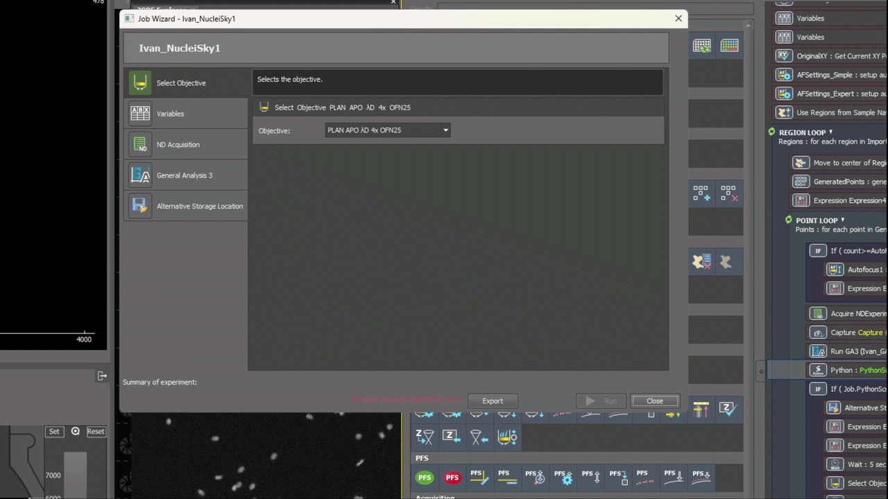

There are four input parameters that you will need to set on the JOBS wizard before running it:

1) **Select Objective**: select the objective that you want to use for scanning the large area. As long as nuclei can be detected, we recommend using a low-magnification objective to speed up the scanning process.
2) **Variables**: only one variable is defined `AutoFocus_Count`. This variable is used to define every few passes how many times the auto focus will be run. The default value is 1, which means that everythe auto focus will be run on every scanning position. If you want to speed up the process at the cost of maybe not being in focus on some of the scanning points, increase the values in `Initial Value` and `Current Value`.
3) **NDAcquisition**: If you followed previous intructions, this should be already set up and you could skip it.
4) **GeneralAnalysis3**: You will need to point to the Query image that you want to re-localise in the scanned area. You should point to a Z-Stack of the nuclei channel that you want to re-localise. 
5) **Alternative Storage Location**: If you want to save the results in a different location than the default one, you can set it here. Otherwise, you can skip it.

#### 2. Let the JOBS workflow run and wait for the results

After setting the input parameters, click on `Run` to start the JOBS workflow. The process will go as the following GIF and you would not need to do anything else:

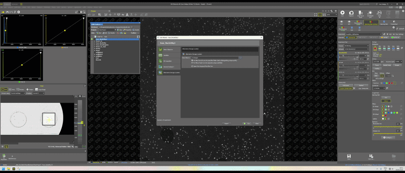